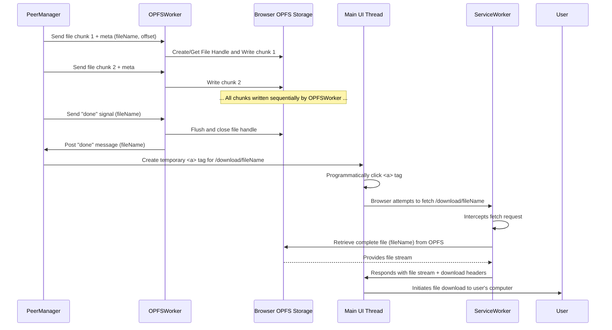
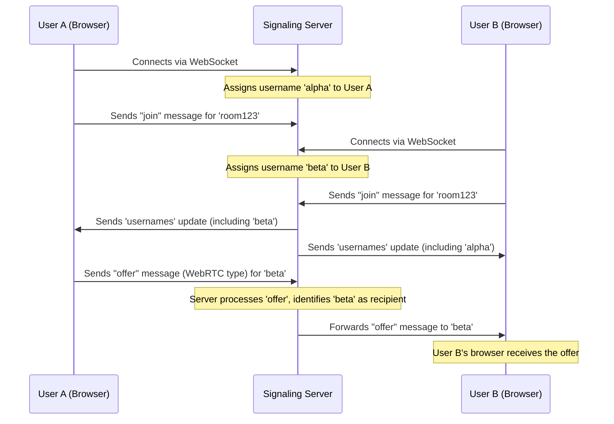

# FileZone 

A fast, secure, **peer-to-peer** file sharing app built with **WebRTC**, **React**, and **Go**. No file is ever uploaded to a server — everything is shared directly between connected users inside a room.

-  Real-time file sharing via WebRTC DataChannels
-  Join rooms and share with multiple peers
-  no centralized file storage
-  Lightweight Go WebSocket signaling server

## How It Works

1. A user creates or joins a room.
2. The app establishes WebRTC connections with all other peers in the room.
3. Files are sent directly through P2P WebRTC DataChannels.
4. Recipients can instantly download the shared files.

## Data flow of file transfer

## Signaling Server flow

## Design overview
- Signaling server: Handles websocket coordination for WebRTC setup and exchanging signaling data along with text messages.
- WebRTC data channels: Handles the file transfer. Files are broken into chunks and sent with identifiers (id, offset) to ensure correct reassembly from ArrayBuffers.
- OPFS: Stores incoming data chunks and reassembles them. Enabling sharing of large files without memory issues. A web worker is used to write to OPFS to prevent freezing the main thread.
- Service worker: Acts as a virtual download layer by intercepting HTTP requests and streaming files directly from OPFS to the browser’s download system.

## Tech Stack

| Layer      | Tech                       |
|------------|----------------------------|
| Frontend   | React, Zustand, Tailwind   |
| Backend    | Go (WebSocket server)      |
| P2P        | WebRTC                     |

